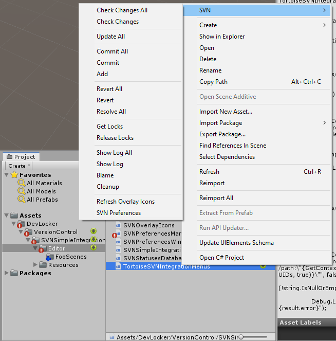

# SVNSimpleIntegration

Simple but powerful SVN Integration for Unity 3D utilizing [TortoiseSVN](https://tortoisesvn.net/) UI. A must have plugin if you use SVN as your version control system in your project.

## Installation:
* Github upm package - merge this to your `Packages/manifest.json`
```
{
  "dependencies": {
    "devlocker.versioncontrol.svnsimpleintegration": "https://github.com/NibbleByte/SVNSimpleIntegration.git#upm"
}
```
* Asset Store plugin: *Working on it*

## Prerequisites:
* Have installed SVN installed
  * Have installed SVN command line interface (CLI)
* (Optional) Have TortoiseSVN installed.


## Features:
* **Hooks up to Unity move and delete file operations and executes respective svn commands to stay in sync.**
  * **Handles meta files as well.**
  * Moving assets to unversioned folder will ask the user to add that folder to SVN as well.
  * Moving folders / files that have conflicts will be rejected.
  * Will work with other custom tools as long as they move / rename assets using Unity API.
Provides assets context menu for manual SVN operations like commit, update, revert etc.
* **Show overlay svn status icons**
  * Show server changes that you need to update.
  * Show locked files by you and your colleges. 
* Minimal performance impact
* You don't have to leave Unity to do SVN chores.
* File operations *should* be cross-platform. TortoiseSVN menus are not.

*Check the screenshots below*

## Usage
Do your file operations in Unity and the plugin will handle the rest.

User SVN operations are available in the menu (or right-click on any asset): `Assets/SVN/...`

**WARNING: Never focus Unity while the project is updating in the background. Newly added asset guids may get corrupted in which case the Library folder needs to be deleted. <br />
Preferred workflow is to always work inside Unity - use the \"Assets/SVN/...\" menus. \"Assets/SVN/Update All\" will block Unity while updating, to avoid Unity processing assets at the same time. <br />
This is an issue with how Unity works, not the plugin iteself. Unity says its by "design".**

## Overlay Icons
* Unversioned 
* Modified 
* Added 
* Deleted 
* Conflict 
* Locked by me 
* Locked by others 
* Server has changes, update 

## Screenshots



